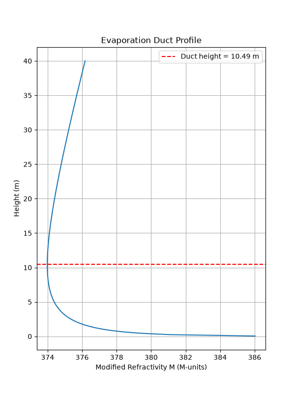
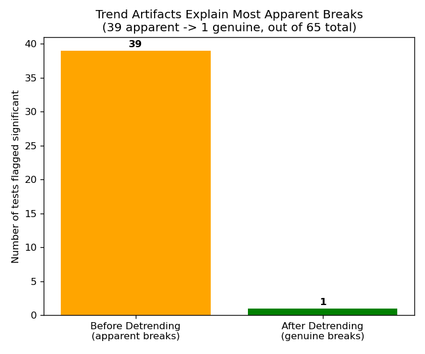
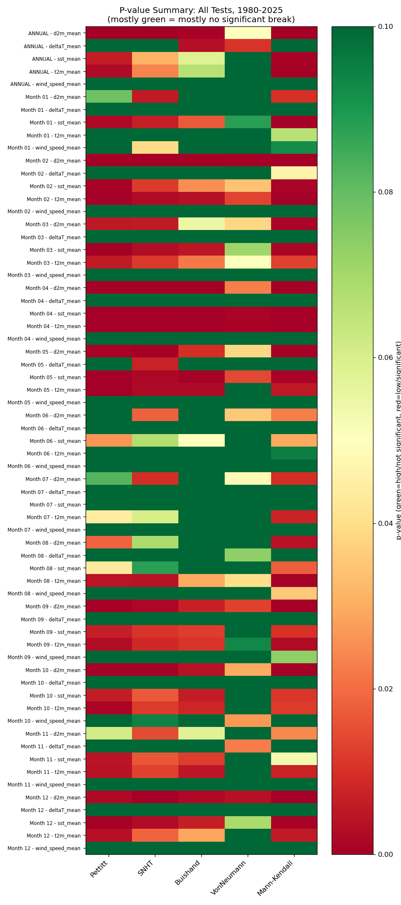
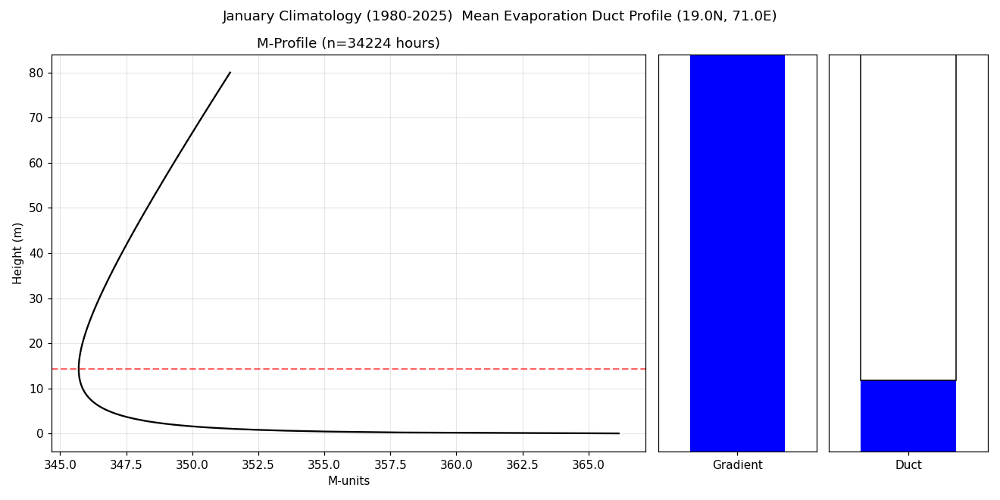

# ERA5 Evaporation Duct Height Reconstruction and Analysis for the Mumbai Coastal Region

A physics-based pipeline for reconstructing the marine atmospheric surface layer from ERA5 reanalysis data and estimating evaporation duct height and its influence on low-altitude electromagnetic wave propagation over the Arabian Sea.

<p align="center">
  
</p>

<p align="center">
  <em>Reconstructed modified-refractivity (M) profile with the detected evaporation duct height marked — the core physical output of this pipeline.</em>
</p>

---

## 1. Objectives

This project addresses four linked research questions:

1. **Is the ERA5 historical record statistically homogeneous, and if not, what climatological period should be used?**
2. **How can radio refractivity, and the evaporation duct height derived from it, be estimated from ERA5 bulk surface variables alone?**
3. **Can the marine atmospheric surface layer required for evaporation-duct calculations be reconstructed from ERA5 bulk surface observations?**
4. **How does evaporation duct height vary seasonally, diurnally, and from year to year over the study region?**

---

## 2. Study Region

| Parameter | Domain |
|---|---|
| Latitude | 17°N – 20°N |
| Longitude | 70°E – 74°E |
| Spatial resolution | 1° × 1° |
| Reference location | 19°N, 71°E |
| Historical record examined | 1940 – 2025 |
| Final climatological period | 1980 – 2025 |

The region is relevant to marine electromagnetic propagation because the lower atmosphere over the Arabian Sea exhibits strong temperature and humidity gradients associated with evaporation, turbulent mixing, sea-surface conditions, and atmospheric stability — the physical drivers of evaporation ducting.

---

## 3. Methodology Overview

```text
## 3. Methodology

The analysis follows a sequential workflow, beginning with the historical ERA5 record and ending with the reconstruction and climatological analysis of evaporation duct height.

**1. ERA5 data preparation**  
Hourly surface meteorological variables are extracted and organised for the Mumbai coastal Arabian Sea domain.

**2. Historical statistical assessment**  
The 1940–2025 record is examined using multiple homogeneity, trend, and breakpoint tests, followed by detrending and re-testing.

**3. Study-period selection**  
The statistical results and data completeness are used to establish 1980–2025 as the principal climatological study period.

**4. Surface-layer reconstruction**  
The Paulus–Jeske bulk formulation and Monin–Obukhov similarity theory are used to reconstruct the near-surface temperature and humidity profiles from 0.05 m to 80 m.

**5. Refractivity calculation**  
The reconstructed atmospheric profiles are converted to radio refractivity and modified refractivity using the ITU-R P.453 formulation.

**6. Evaporation duct identification**  
The near-surface minimum in the modified-refractivity profile is identified as the evaporation duct height, subject to boundary-based quality control.

**7. Climatological analysis**  
The resulting duct-height series is analysed across monthly, diurnal, and annual timescales, together with probability distributions and cumulative distributions.

```

---

## 4. ERA5 Input Data

Hourly ERA5 single-level reanalysis data, provided by the Copernicus Climate Change Service and ECMWF.

| Variable | ERA5 short name | Role in the model |
|---|---|---|
| 2 m temperature | `t2m` | Near-surface thermal state |
| 2 m dew-point temperature | `d2m` | Near-surface moisture |
| 10 m wind (u, v components) | `u10`, `v10` | Surface turbulence and stability |
| Sea-surface temperature | `sst` | Lower boundary temperature |
| Mean sea level pressure | `msl` | Atmospheric thermodynamic state |

These five bulk surface variables are the complete input set required by the Paulus–Jeske reconstruction — no upper-air or pressure-level data is used.

Corresponding ERA5 input files are stored under `01_Era5_Raw_Data/`.

---

## 5. Selection of the 1980–2025 Study Period

The available ERA5 record for this domain extends from 1940 to 2025. Rather than choosing a start year arbitrarily, the full historical record was tested for homogeneity using six independent statistical methods:

- Pettitt change-point test
- Standard Normal Homogeneity Test (SNHT)
- Buishand Range test
- Von Neumann Ratio test
- Mann–Kendall trend test
- Multiple-breakpoint detection (PELT / Bai–Perron-style)

Each test was followed by **linear detrending and re-testing**, to distinguish genuine abrupt discontinuities from smooth long-term climatic trends that a naive changepoint test can misidentify as a break.

**65 independently evaluated series** were tested: 12 monthly series × 5 variables, plus 5 annual mean series.

**Result:** 39 of 65 series showed an apparent significant break before detrending; only 1 of 65 remained significant afterward — statistically consistent with the false-positive rate expected from running 65 tests at a 5% significance threshold. The record was found to be fundamentally homogeneous across 1940–2025.

**1980 was therefore adopted as the study-period start on data-completeness grounds** (the first year with full, consistent 12-month ERA5 coverage across the domain), not as a statistically-driven exclusion of earlier decades.

Diagnostics are in `04_Anchor_Period_Statistical_Analysis/`, including detrending summaries, p-value heatmaps, breakpoint diagnostics, annual trend analyses, and the pilot duct-profile validation.

<p align="center">
  
  
</p>

---

## 6. Atmospheric Surface-Layer Reconstruction

ERA5 provides meteorological variables only at fixed standard heights — it does not directly provide the continuous vertical temperature and humidity structure an evaporation-duct calculation needs. This project reconstructs that structure using a bulk surface-layer formulation based on:

- **Paulus–Jeske** bulk method
- **Monin–Obukhov similarity theory**
- **Businger–Dyer** stability functions
- **Charnock** surface roughness relation

The five bulk ERA5 inputs feed an iterative solver (friction velocity, temperature scale, humidity scale, Monin–Obukhov length, converged over 20 iterations) that reconstructs continuous profiles from **0.05 m to 80 m** above the sea surface.

---

## 7. Radio Refractivity

The reconstructed profile is converted into radio refractivity using the **ITU-R P.453** formulation:

```
N = 77.6 (P/T) + 3.73×10⁵ (e/T²)
```

where P is pressure (hPa), T is temperature (K), and e is water vapour pressure (hPa).

Modified refractivity is then computed as:

```
M(z) = N(z) + 0.157z
```

where z is height above the surface in metres. The vertical gradient of M(z) governs the anomalous propagation behaviour of the marine surface layer.

---

## 8. Evaporation Duct Height

```

The final objective of the atmospheric reconstruction is to translate the continuous vertical thermodynamic structure of the marine surface layer into a physically meaningful evaporation duct height.

The reconstructed temperature and humidity profiles are first used to calculate radio refractivity, `N(z)`. This is then expressed as modified refractivity to account for the curvature of the Earth:

`M(z) = N(z) + 0.157z`

where `z` is height above the sea surface in metres.

The resulting `M(z)` profile provides the basis for identifying the evaporation duct. When modified refractivity decreases with height near the sea surface, electromagnetic waves are refracted downward, creating conditions in which radio energy can become trapped within the lower atmosphere. As height increases, the profile eventually reaches a minimum before transitioning to an increasing gradient.

The height of this minimum is used to determine the evaporation duct height.

### Interpreting the Modified-Refractivity Profile

For a resolved evaporation duct, the profile can be understood in three parts:

1. **Near-surface trapping layer**  
   Modified refractivity decreases with height, producing the refractive conditions required for electromagnetic trapping.

2. **Duct-height minimum**  
   `M(z)` reaches its minimum and the vertical gradient changes sign. This point defines the reconstructed evaporation duct height.

3. **Atmosphere above the duct**  
   Modified refractivity increases with height, indicating that the strong trapping condition has weakened above the duct.

The figure below shows the **January climatological modified-refractivity profile for 1980–2025**, generated directly from the reconstructed atmospheric profiles in this study. It represents the average vertical refractive structure of the marine surface layer for January across the complete study period.



*January climatological modified-refractivity profile for 1980–2025. The vertical structure of M(z) provides the physical basis for determining the corresponding evaporation duct height.*

This profile-based approach keeps the estimated duct height directly connected to the underlying atmospheric state. Rather than treating duct height as an independent statistical prediction, the value emerges from the reconstructed temperature and humidity structure and its resulting refractive properties.
```
## 9. Quality Control

A minimum found within the **top 10% of the reconstructed 80 m profile**, or exactly at the surface, is not assigned a numerical duct height. In these cases the true refractivity minimum likely lies outside the resolvable range — most commonly under strongly stable, low-wind conditions where the trapping layer extends beyond what a bounded surface-layer reconstruction can resolve.

```
Not every reconstructed profile provides enough information to assign a reliable duct height. The detected minimum is therefore evaluated against the vertical range over which the profile is resolved.

A profile is classified as **resolved** when a physically meaningful minimum occurs within the resolved height range. In this case, the detected minimum can be used confidently as the evaporation duct height.

When the profile does not contain a reliable interior minimum, the result is classified as **unresolved**. This can occur when the profile continues to decrease up to the upper boundary of the model domain, indicating that the actual minimum may lie above the resolved range. Such cases are not assigned an artificial duct height and are instead retained as unresolved observations.

This distinction prevents boundary-limited profiles from being interpreted as physically resolved ducts and provides an explicit quality-control step between profile reconstruction and the final climatological analysis.
```

Such hours are recorded as unresolved (NaN) rather than assigned a forced, non-physical value — preventing the climatological statistics from being biased by boundary artefacts. The 80 m ceiling itself is set from published Arabian Sea field measurements reporting stable-condition duct heights up to ~74 m, giving margin above the physically observed maximum. Across the full dataset, roughly 0.15–0.2% of hours are flagged unresolved by this criterion.

---

## 10. Climatological Analysis

**Monthly climatology** — seasonal structure of meteorological variables and duct height.

**Diurnal climatology** — hourly observations are converted from UTC to **Indian Standard Time (IST)** and classified into four six-hour bands:

- 00:00 – 06:00 IST
- 06:00 – 12:00 IST
- 12:00 – 18:00 IST
- 18:00 – 24:00 IST

**Annual variability** — year-by-year analysis across the full 1980–2025 study period.

**Distribution analysis** — probability density functions (PDF) and cumulative distribution functions (CDF) characterise the statistical behaviour of each variable and the derived duct height.

Corresponding visualisations are organised into the climatology, PDF/CDF, and wind-speed directories described in Section 12.

---

## 11. Wind-Speed Analysis

Wind speed is a key driver of the evaporation-duct problem: it governs turbulent mixing, aerodynamic surface roughness, atmospheric stability, sensible/latent heat exchange, and the resulting near-surface humidity gradient that shapes the refractivity structure. Dedicated wind-speed climatology and annual summary charts are included as an additional interpretive basis for the reconstructed duct height variability.

---

## 12. Repository Structure

```
Era5-Evaporation-Duct-Prediction-Analysis/
│
├── 01_Era5_Raw_Data/
│   └── ERA5 GRIB / NetCDF input data (1940–2025, Mumbai coastal domain)
│
├── 02_Python_Codes/
│   └── Complete computational and analysis pipeline
│
├── 03_Tables/
│   └── Statistical results and climatological tables
│
├── 04_Anchor_Period_Statistical_Analysis/
│   └── Historical statistical analysis and study-period selection
│
├── 05_Duct_Profiles/
│   └── Reconstructed modified-refractivity profiles
│
├── 06_Bar_Charts_1988/
│   └── Pilot distribution analysis (single-year validation case)
│
├── 07_Bar_Charts_Monthly_Climatology_1980-2025/
│   └── Monthly climatological distributions
│
├── 08_Bar_Charts_Yearly_Climatology_1980-2025/
│   └── Annual climatological distributions
│
├── 09_PDF_CDF_1940_2025/
│   └── Historical (pre-study-period) PDF/CDF analysis
│
├── 10_PDF_CDF_1980_2025/
│   └── Study-period PDF/CDF analysis
│
├── 11_Wind_Speed_Bars_Charts_Climatology/
│   └── Wind-speed climatological summaries
│
└── 12_Wind_Speed_Bars_Charts_Yearly/
    └── Year-wise wind-speed summaries
```

---

## 13. Python Pipeline

All scripts live in `02_Python_Codes/`, organised by stage:

**Data acquisition and preparation**
```
A_era5_download_1990_2025.py     ERA5 CDS API retrieval
B_MASTER_CSV.py                   Consolidated monthly-mean master table
```

**Statistical analysis**
```
C_Pettitt_Test.py
C_SNHT_Test.py
C_Buishand_Range_Test.py
C_Breakpoint_Test.py
C_Mann_Kendall_Test.py
C_Detrending.py
C_Combined_Statistical_Tests.py    Full 65-series battery in a single run
```

**Temporal classification**
```
D_Time_Band_Classification.py     UTC → IST conversion, 4 diurnal bands
```

**Evaporation duct computation**
```
E_Evaporation_Duct_Height_Computation.py
   Surface-layer reconstruction, refractivity, modified refractivity,
   duct height extraction with boundary-hit quality control
```

**Distribution and climatology**
```
F_Histogram_Per_Month.py
F_Histogram_Per_Year.py
F_Summary_Bar_ALL_Year.py
F_Summary_Bar_All_Months.py
```

**Duct-profile visualisation**
```
G_Duct_Profile_Per_Month.py
G_Duct_Profile_Per_Year.py
G_Duct_Profile_ALL_Months.py
```

---

## 14. Main Outputs

**Statistical outputs** — homogeneity-test results, breakpoint locations, detrended re-test results, p-value summaries, trend statistics, historical comparison plots.

**Atmospheric outputs** — temperature, dew-point, and sea-surface temperature distributions; wind-speed climatology; reconstructed surface-layer profiles.

**Electromagnetic propagation outputs** — radio refractivity profiles, modified refractivity profiles, evaporation duct height, monthly/diurnal/annual duct climatology.

---

## 15. Key Findings

- Evaporation duct height at the reference point (19°N, 71°E) is consistently confined to the low-altitude marine surface layer, generally in the range of ~3–30 m, with a pronounced seasonal cycle.
- Atmospheric stability, wind speed, temperature, humidity, and sea-surface temperature jointly determine the reconstructed duct structure.
- The historical statistical analysis supports 1980–2025 as the principal climatological period, on data-completeness rather than data-quality grounds.
- A small, well-characterised fraction of profiles (~0.15–0.2%) are classified as unresolved rather than assigned potentially misleading numerical duct heights.
- The reconstructed climatology is broadly consistent with the physical characteristics of evaporation ducts reported for the Arabian Sea in prior observational studies (e.g., unstable-condition means around 12–14 m, stable-condition maxima approaching 70+ m).

---

## 16. Validation and Physical Consistency

**Statistical validation** — the historical record is examined using six independent homogeneity/trend-detection methods, cross-checked against detrended re-testing, rather than a single test.

**Profile-level validation** — reconstructed profiles were visually and numerically inspected via M(z) curves and their corresponding detected duct heights, including a dedicated pilot validation (January 1988, reference point) before scaling to the full 1980–2025 dataset.

**Literature comparison** — derived duct-height statistics were compared against a peer-reviewed Arabian Sea surface-layer measurement study (AMS 2020), showing consistent unstable- and stable-condition ranges.

These comparisons are physical consistency checks, not a substitute for direct observational validation. Shipborne instruments, radiosondes, or dedicated evaporation-duct observing systems would provide a stronger basis for future quantitative validation.

---

## 17. Reproducibility

```
1. ERA5 hourly data acquisition
2. Master-table preparation
3. Historical statistical assessment
4. Detrending and breakpoint analysis
5. Study-period selection
6. IST-based time-band classification
7. Marine surface-layer reconstruction
8. Atmospheric refractivity calculation
9. Evaporation duct-height determination
10. Climatological analysis
11. Profile, distribution, and summary generation
```

The corresponding implementation for every stage is in `02_Python_Codes/`.

---

## 18. Limitations

- ERA5 provides a modelled atmospheric state, not direct local observations.
- Evaporation duct height is reconstructed via bulk similarity theory, not directly measured.
- The surface-layer reconstruction depends on the assumptions of the Paulus–Jeske / Monin–Obukhov formulation and its associated stability functions.
- The 80 m vertical reconstruction imposes an upper limit on directly resolved duct structures.
- Coastal atmospheric conditions can exhibit spatial variability not fully captured by a 1°×1° analysis grid.
- Literature-based validation cannot replace simultaneous local field measurement.

---

## 19. Future Work

- Validation against shipborne and coastal atmospheric observations
- Comparison with radiosonde-derived refractivity profiles
- Sensitivity analysis of alternative surface-layer parameterisations (e.g., Naval Postgraduate School model)
- Uncertainty propagation from ERA5 input variables through to duct height
- Higher-resolution coastal modelling
- Spatial mapping of evaporation duct climatology across the wider Arabian Sea
- Coupling reconstructed duct height with electromagnetic propagation/radar models
- Investigation of extreme ducting events and anomalous propagation episodes

---

## 20. Technology Stack

**Programming and scientific computing** — Python, NumPy, Pandas, xarray, SciPy, Matplotlib

**Reanalysis data processing** — Copernicus Climate Data Store API, ERA5, GRIB, NetCDF, cfgrib

**Statistical analysis** — pyhomogeneity, pymannkendall, ruptures, SciPy

**Physical modelling** — Monin–Obukhov similarity theory, Businger–Dyer stability functions, Paulus–Jeske bulk formulation, Charnock surface roughness, ITU-R P.453 refractivity formulation

---

## 21. Data Source

**Provider:** Copernicus Climate Change Service (C3S) / ECMWF
**Dataset:** ERA5 hourly data on single levels
**Temporal coverage examined:** 1940–2025
**Final climatological analysis period:** 1980–2025
**Access:** https://cds.climate.copernicus.eu

---

## 22. Scientific Context

Evaporation ducts are relevant to maritime electromagnetic propagation because the refractive structure of the lower atmosphere can significantly extend or otherwise modify the effective propagation path of radio waves beyond the standard radio horizon. Understanding their climatological behaviour has applications in maritime communications, coastal radar systems, over-the-horizon propagation, naval electromagnetic sensing, RF link planning, anomalous propagation studies, and atmospheric remote sensing.

This project establishes a reproducible atmospheric and statistical framework for estimating the evaporation-duct environment from long-term reanalysis data.

---

## 23. Author

**Midushi Maheshwari**  
B.Tech. Electronics and Communication Engineering with Specialization in AI | IGDTUW |  Undergraduate Research Project 

### Citation

If this repository or its methodology is used in subsequent research, please cite the repository and acknowledge the underlying ERA5 dataset and the physical parameterisations referenced in Section 20.

### License

This repository is currently being prepared for public research release. Licensing information will be provided with the release.

For further information, please contact [midushi.maheswari@gmail.com]
